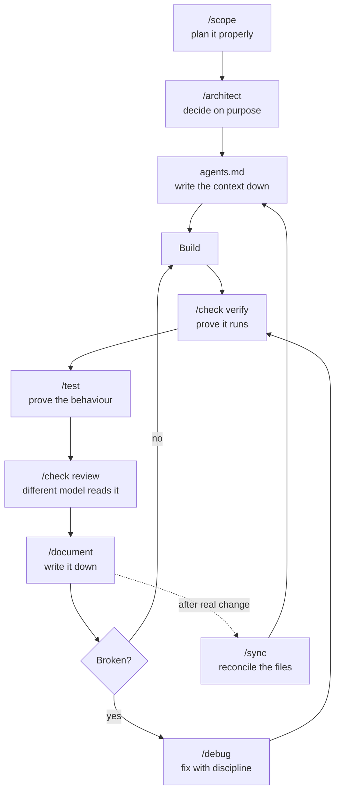
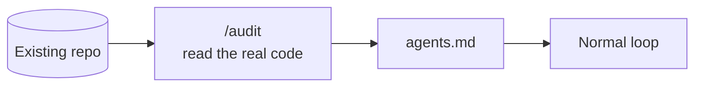

# Engineering Workflow With Prompts

Requirements before code is the discipline in software. That doesn't change when an agent is writing the code — it matters more, because an agent will happily build the wrong thing very fast.

This is the workflow: plan, design, write the context down, build, then prove it.

---

## Table of Contents

- [Engineering Workflow With Prompts](#engineering-workflow-with-prompts)
  - [Table of Contents](#table-of-contents)
  - [1. Plan First](#1-plan-first)
  - [2. Scope](#2-scope)
    - [`/scope` — plan it properly](#scope--plan-it-properly)
  - [3. Architect — Decide on Purpose](#3-architect--decide-on-purpose)
    - [`/architect` — stack and architecture](#architect--stack-and-architecture)
  - [4. Context Files — `agents.md`](#4-context-files--agentsmd)
    - [`/document` — keep state in files](#document--keep-state-in-files)
  - [5. Keeping Context True — `/audit` and `/sync`](#5-keeping-context-true--audit-and-sync)
    - [`/audit` — work on real code](#audit--work-on-real-code)
    - [`/sync` — reconcile the files with reality](#sync--reconcile-the-files-with-reality)
  - [6. Proving It Works — The Four Jobs](#6-proving-it-works--the-four-jobs)
    - [`/check verify` — prove it runs](#check-verify--prove-it-runs)
    - [`/test` — prove the behaviour](#test--prove-the-behaviour)
    - [`/check review` — judge the code](#check-review--judge-the-code)
    - [`/document` — write it down](#document--write-it-down)
    - [`/debug` — fix with discipline](#debug--fix-with-discipline)
  - [7. The Whole Loop](#7-the-whole-loop)
  - [8. Quick Reference](#8-quick-reference)
  - [9. Install](#9-install)
  - [10. Links](#10-links)
  - [11. What This Doesn't Cover Yet](#11-what-this-doesnt-cover-yet)

---

## 1. Plan First

Before anything else, answer four questions:

- **What are we building?**
- **What's in the first version?**
- **What's explicitly out?**
- **In what order?**

The third one does the most work and gets skipped the most. "Explicitly out" is not the same as "not mentioned." If it isn't written down as out of scope, an agent will treat it as fair game and build it — and then you're reviewing code for a feature you never wanted.

The fourth one matters because order encodes dependencies. Billing can't come before accounts. Usage limits can't come before usage.

---

## 2. Scope

The plan of what you are building. For a team product, that's something like:

- Accounts and roles
- Invite a teammate
- Shared library
- Usage limits
- Billing

**Decide how you build it *after* this** — stack, database, hosting. Those are answers to the requirements, not a substitute for having them. Picking the stack first means you end up shaping the product around a technology choice you made before you knew what the product was.

That scope turns a vague idea into an ordered plan.

Then you start building.

### `/scope` — plan it properly

Run the scoping conversation before any design or code exists. The output is a written plan: what's in, what's out, and the order.

---

## 3. Architect — Decide on Purpose

You need to design how the system is actually built:

- Database and data model
- Tech stack
- Critical logic
- How it scales

### `/architect` — stack and architecture

Before any code, it runs through the design conversation. It thinks in patterns first.

The value here isn't that the agent knows more architecture than you. It's that the decisions get *made deliberately and written down*, instead of being made accidentally by whatever the agent typed first. An architecture that emerged by accident is one nobody can explain or change later.

---

## 4. Context Files — `agents.md`

`agents.md` is the file that tells the agent how the project actually works — the stack, the commands, the conventions.

Without it, every session starts from zero. The agent re-derives your project from scratch by reading files, guesses your conventions, and guesses differently next time. With it, the agent starts already knowing the shape of the thing.

**A single app gets one `agents.md` file.**

What belongs in it:

- **Stack** — languages, framework, database, key libraries
- **Commands** — how to install, run, test, build, lint. The exact commands
- **Conventions** — file layout, naming, patterns you actually use
- **Constraints** — what not to touch, what not to install, what's deliberately done "the weird way" and why

That last one earns its place quickly. Most of the time an agent does something you don't want, it's because a constraint existed only in your head.

### `/document` — keep state in files

Write it down. Write the human description. The point of this skill is that project knowledge lives in files in the repo, not in a chat history that disappears.

---

## 5. Keeping Context True — `/audit` and `/sync`

### `/audit` — work on real code

Reads your actual project — the structure, the stack, all of it. Use it when the context files don't exist yet, or when you've inherited a codebase and need the description generated from what's really there rather than from what someone intended.

### `/sync` — reconcile the files with reality

Context files rot. You describe the project in month one, then for three months you swap the auth library, rename half the routes, and add a queue. The file still describes month one. Now the agent is confidently building against a project that no longer exists — and that's worse than having no file at all, because wrong context is followed just as obediently as right context.

`/sync` reconciles those files against what the repo actually shows now. So the context you read in month three still describes the app you actually have.

Rule of thumb: run it after anything that would change the answer to "what stack is this?" or "how do I run this?"

---

## 6. Proving It Works — The Four Jobs

If the AI says "done" and it doesn't work, that's a problem. And there's a trap that makes it worse: **the tests are green.**

Green tests written by the same agent that wrote the code prove one thing — that the code does what the agent thinks it does. If the agent misunderstood the requirement, the test encodes the misunderstanding and passes. Confidently.

So verification is really **four separate jobs**, and no single one of them covers the others:

| Job | Skill | What it actually proves |
|---|---|---|
| Verify | `/check verify` | It runs. The app starts and the functionality works |
| Test | `/test` | The behaviour is correct, and stays correct |
| Review | `/check review` | The code is good — judged by reading it |
| Document | `/document` | A human can understand what was built |

### `/check verify` — prove it runs

Runs the app and checks all the functionality. Not "the build compiled" — the actual feature does the actual thing.

### `/test` — prove the behaviour

Tests exist to catch the change you make *next month* that quietly breaks this. Write them against the requirement from `/scope`, not against the implementation that was just written.

### `/check review` — judge the code

Reads the code on a **different model**. This is the part that's easy to skim past and it's the whole point: a model reviewing its own output shares its own blind spots. A different model doesn't have the same ones. You want a reader who wasn't in the room when the code was written.

### `/document` — write it down

Write the human description. The thing you'll read in three months when you've forgotten all of this.

### `/debug` — fix with discipline

When something is broken: reproduce it, find the actual cause, fix that. Not "try a change and see if the error goes away." An agent left unsupervised will patch symptoms all day and each patch makes the next bug harder to find.

---

## 7. The Whole Loop



And for an existing codebase you didn't plan, you enter from the side:



---

## 8. Quick Reference

| Skill | Use it for | Run it when |
|---|---|---|
| `/scope` | Plan it properly | Before anything exists |
| `/architect` | Decide on purpose | After scope, before code |
| `/document` | Keep state in files | After building anything worth remembering |
| `/audit` | Work on real code | Inheriting or reverse-engineering a project |
| `/sync` | Reconcile docs with reality | After the stack, commands or structure change |
| `/check verify` | Prove it runs | Before believing "done" |
| `/test` | Prove the behaviour | Alongside the code, from the requirement |
| `/check review` | Judge the code | On a different model, before merge |
| `/debug` | Fix with discipline | When something breaks |

**The short version:** plan it properly, decide on purpose, keep state in files, work on real code, prove it runs, fix with discipline.

---

## 9. Install

```bash
npx skills@latest add jsmastery-pro/skills -a claude-code
```

---

## 10. Links

- Skills — https://jsmastery.com/skills
- Workflow guides — https://jsmastery.com/workflow-guides

---

## 11. What This Doesn't Cover Yet

Gaps worth knowing about, so the picture isn't mistaken for complete:

- **Task size** — how much to hand an agent at once. Large vague tasks produce large vague diffs that nobody can review.
- **Commit discipline** — small commits with a working state at each one, so "undo the last thing" is always available.
- **Human review is still required.** `/check review` narrows what you have to read closely; it doesn't remove you from the loop, especially for auth, payments, data deletion, and anything touching user data.
- **Secrets and credentials** — what an agent is allowed to read, and what never goes into a context file.
- **Monorepos** — the note says one app gets one `agents.md`. What a multi-package repo needs (a root file plus per-package files) isn't settled here.
- **When the plan turns out wrong** — scope written on day one meets reality on day ten. Re-scoping deliberately beats quietly drifting away from the plan.