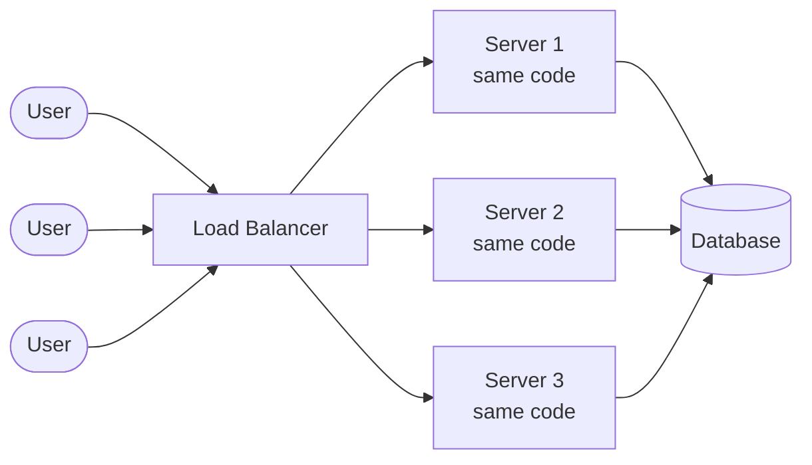
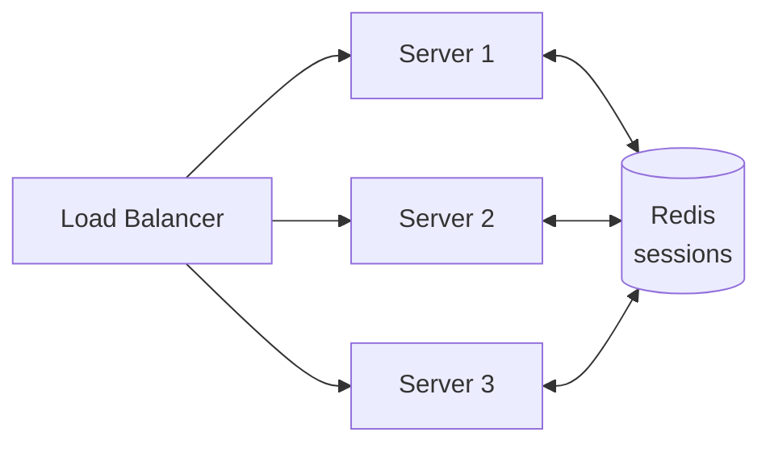
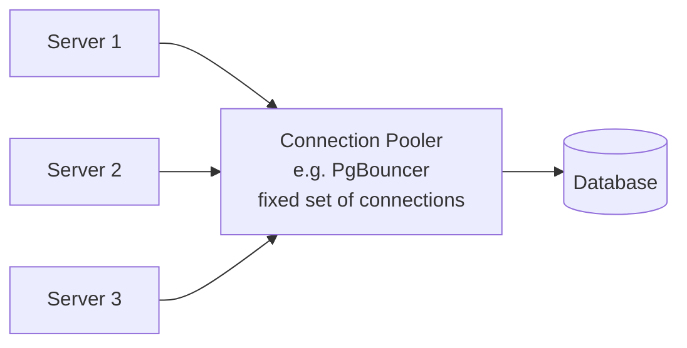
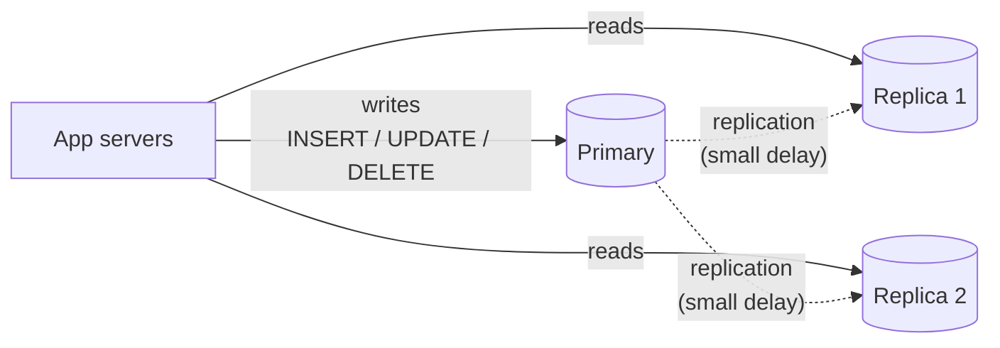
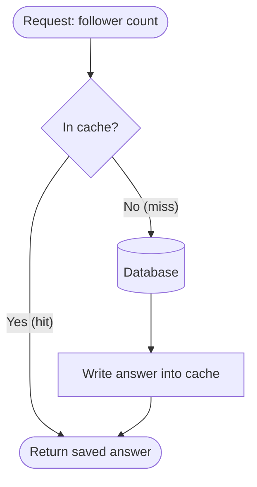
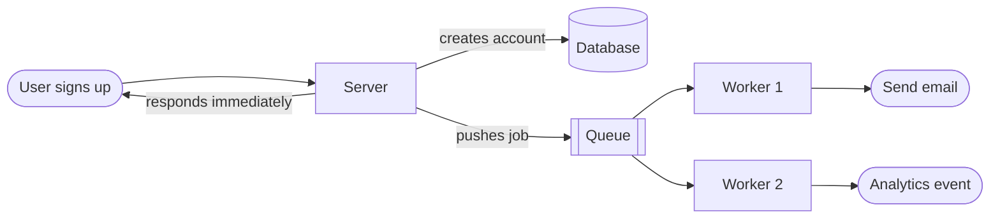
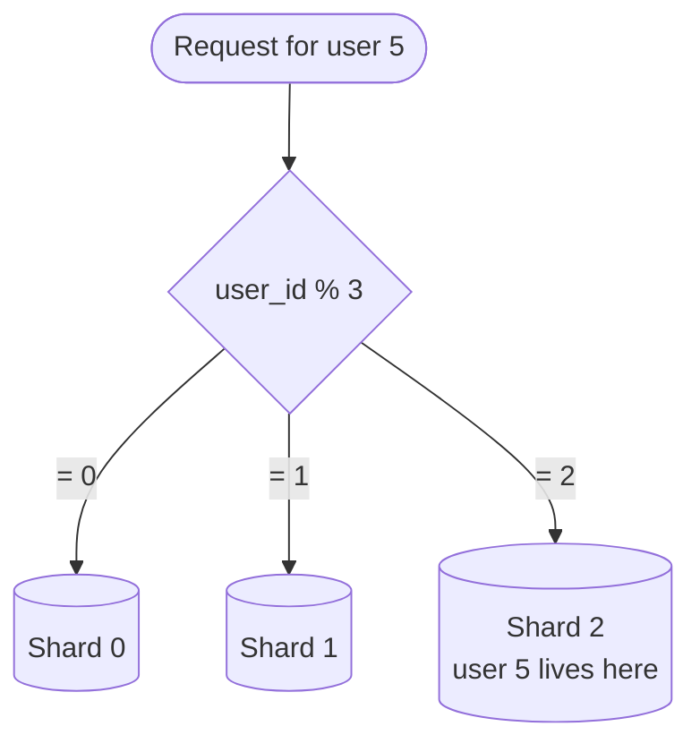

# System Design Notes — Scaling an Application Step by Step

System design actually matters when your application is growing and you need to scale it. It is the process of defining the architecture, components, modules, interfaces, and data of a system so that it satisfies a set of requirements.

Every section below starts from a problem that the previous section created. That order is the whole point: you don't add these pieces because they sound impressive, you add them because something broke.

---

## Table of Contents

1. [Where Everyone Starts](#0-where-everyone-starts)
2. [Load Balancer](#1-load-balancer)
3. [Stateless Servers](#2-stateless-servers)
4. [Connection Pooling and Read Replicas](#3-connection-pooling-and-read-replicas)
5. [Caching](#4-caching)
6. [Queues and Background Jobs](#5-queues-and-background-jobs)
7. [Sharding](#6-sharding)
8. [Closing — Why Pick One Over the Other](#7-closing--why-pick-one-over-the-other)
9. [What These Notes Don't Cover Yet](#8-what-these-notes-dont-cover-yet)

---

## 0. Where Everyone Starts

```
your app server  =======>  database
```

One server holds your app, one database holds your data. That's it. And this is genuinely enough for thousands of users — most applications never need to go past this diagram.

If the app grows and you need to scale, you can add more servers to handle the load. That's where system design comes in.

**The rule to carry through the whole document:** don't add a piece until the current setup is actually hurting. Every box you add is another thing that can fail, another thing to pay for, and another thing to debug at 2am.

---

## 1. Load Balancer

Suppose you build a ticket booking application. You have a single server handling all the requests from users. Now there's a trending movie and thousands of users are trying to book tickets at the same time. Your single server will not be able to handle all the requests and will crash.

When thousands of requests come at once, they pile up in a queue and wait for the server to process them. Response time goes up and users have a bad experience.

To handle this load, you can add more servers and use a load balancer to distribute the requests among them. This way your application can serve thousands of users without crashing.

### Two options to handle load

**1. Vertical scaling** — adding more resources (CPU, RAM) to your existing server. This is limited by the maximum capacity of a single machine and it gets expensive fast. It becomes costlier and costlier as you keep upgrading the server to handle more load.

**2. Horizontal scaling** — adding more servers to share the load. This is more cost-effective and gives you better fault tolerance. If one server goes down, the load balancer redirects traffic to the others. More machines sharing the load.

| | Vertical scaling | Horizontal scaling |
|---|---|---|
| What you do | Make one machine bigger | Run more machines |
| Ceiling | Hard limit — the biggest machine you can buy | Practically none |
| Cost curve | Rises steeply at the top end | Roughly linear |
| Fault tolerance | None — one machine, one failure | One dies, the rest serve |
| Code changes needed | Zero | Servers must be stateless (see §2) |
| Good for | Databases, early stage, quick fix | Web/app servers |

### What "three servers" actually means

Server 1, server 2, server 3 — these are **not three different parts of your application**. This is not one server for payment, one for messaging, one for booking. These are three servers running the *same* application. All three run the same code and any of them can handle any request from any user.

Three identical copies of your app running at the same time. The same code running three times. If one goes down, the load balancer redirects traffic to the other two.

This doesn't mean you deploy your application three times. You ship it once. You just tell your platform to run three instances of it.

### So who decides which server gets the request?

When a request comes in from a user, which server does it go to? Something has to stand in front of the servers and hand each incoming request to one of them — spreading people out evenly so no single server gets overwhelmed while the others sit idle. That thing is the **load balancer**.



Nginx is a classic one. And if you deploy on something like Vercel or Railway, you already have a load balancer — you don't have to think about it.

### The costs nobody mentions

**Cost 1 — the load balancer itself can die.** If the load balancer goes down, it doesn't matter that you have three healthy servers behind it. Nobody can reach them. So in real systems the load balancer *also* has a backup, which is more stuff to run.

**Cost 2 — the quiet one.** For the load balancer to send any request to any server, all your servers have to be **interchangeable**. Any of them has to be able to handle any request. And right now, they are not. That's the next section.

---

## 2. Stateless Servers

We're now running multiple instances of our app. That creates a problem you didn't have with just one.

You log in, and the request happens to land on server 1. Server 1 creates your session and keeps it in its own memory. Your next click gets routed to server 2 — which has never heard of you. So it asks you to log in again. Click again, server 3, log in again.

### The fix

Servers are not allowed to remember anything about you between requests. No server keeps a note in its own memory. Instead, the note goes somewhere all of them can reach — a separate place off to the side that every server can read from and write to.

When you log in, the note gets written to that shared place. On your next click, whichever server picks up the request reads the same shared place, finds your note, and knows it's you.

Redis, for example.



### The general rule

"Stateless" doesn't mean the app has no state. It means **no state lives in a server's own memory**. Anything that has to survive from one request to the next goes into shared storage — a database, Redis, object storage.

A quick test: **if you killed any one server right now at random, would any user notice anything other than a blip?** If yes, something is still stuck in that server's memory.

Things that commonly hide in server memory and break the moment you run two instances:

- Sessions and login tokens
- In-process caches (`const cache = {}` at the top of a file)
- Uploaded files written to the local disk
- Rate-limit counters
- Scheduled jobs / cron running inside the app process — now it runs three times instead of once
- WebSocket connections (one user is connected to *one* server, so broadcasting needs a shared channel like Redis pub/sub)

> **Note on sticky sessions:** some load balancers can pin a user to the same server every time ("sticky sessions" / session affinity). It makes the login problem go away without changing code. It's a patch, not a fix — when that server dies, those users lose their sessions anyway, and the load stops spreading evenly. Prefer shared state.

---

## 3. Connection Pooling and Read Replicas

What if the app is slow again? We load balanced, we added servers, and it's still slow. That means we need to notice what all the servers have in common: **one database**. We scaled the servers but we didn't scale the thing behind them.

### Problem 1 — the database is talking to too many people at once

Every server opens its own connections to the database. Three servers × lots of concurrent requests = hundreds of connections. Each connection costs the database memory and scheduling work, and Postgres in particular starts falling over well before you'd expect.

**Connection pooling:** we keep a small, fixed set of connections open at all times and everything shares them. A request needs the database, so it borrows a connection from the set, uses it, and hands it straight back for the next request to use.

**PgBouncer** is the common one for Postgres, and most managed databases now ship a pooler you can simply switch on.



### Problem 2 — the queries themselves are slow

Before adding any more machines, check the boring thing: **are your common queries actually using indexes?**

If your app looks users up by email on every login and there is no index on the email column, the database is scanning every row to find that user. Add the index and the load drops — sometimes by orders of magnitude, for free.

Check where the database is actually spending its time in *your* app. `EXPLAIN ANALYZE` on your slowest queries and a look at the slow query log will usually tell you more than any architecture change. This step is unglamorous and it is almost always the highest-return thing on this page.

### Problem 3 — too many reads

If your app is mostly reads, keep the **primary** database for changes — `INSERT`, `UPDATE`, `DELETE`.

Then make copies of it that are read-only. When a change happens on the primary, those copies are updated accordingly so they stay up to date. These copies are called **replicas**.



### The cost — replication lag

This approach makes your app a little bit wrong, because the copy takes a moment to catch up.

You post something. That write goes to the primary immediately. Your app then loads your feed, and that read goes to a replica — but the replica hasn't received your new post yet. So you look at your own feed right after posting and your post isn't there. You refresh, and it's there.

That gap is called **replication lag**.

Usually it doesn't matter. Sometimes it does — and for those specific cases the app deliberately reads from the primary instead of a replica. A common pattern: *read-your-own-writes* — for a short window after a user writes something, send that user's reads to the primary.

And that's the real lesson here: **some of the reads are still expensive.** There's a particular kind of question we ask the database over and over, thousands of times, and we almost get the same answer every time. Computing the same answer thousands of times is wasteful.

---

## 4. Caching

For example, you have 2 million followers on your account. Every time someone visits the page you need to fetch that number, which means that many requests go to the database to get the same data. And the follower count doesn't move that fast.

Instead of computing it every time, we compute it once and keep the answer somewhere fast. The next person who asks gets the saved answer, and the database is never touched. An answer kept somewhere fast and close is a **cache**.

### The flow

A request comes in asking for the follower count.

1. First we check the cache.
2. If it's there, we return it and we never go near the database.
3. If it's not, we ask the database, and we put the answer in the cache on the way back — so the next person gets it for free.

It's kept in memory. Often this is Redis — the same Redis already running for sessions.



### The cost — stale data

When a new follower comes in, the cached value is now the old data. That's the problem, and it isn't a bug you can remove: **caching trades correctness for speed on purpose.**

You manage that trade with two levers:

- **TTL (expiry):** the entry deletes itself after, say, 60 seconds. Simple, and good enough for a follower count. The worst case is that someone sees a number that's a minute old.
- **Invalidation:** when the underlying data changes, you delete the cache entry so the next read recomputes it. More correct, more code, and easy to get wrong in a hundred small places.

And some things you simply cannot cache. **A balance, a seat availability, a stock count — anything where being one second out of date is a real bug — doesn't go in a cache.** That's the judgement call: cache what's cheap to be wrong about.

---

## 5. Queues and Background Jobs

Think about your signup flow. It isn't only creating the account. You also need to send the verification email, fire an analytics event, and set up initial data for the new account. If you do all of that before sending the response, the user sits there watching a spinner for the slowest of those things — usually the email.

**Split the work.** The instant the account is created, you answer the user: signup done. The email — you don't send it right then. You write down a note that says *"send a verification email to this person."* That list of notes is a **queue**.

Something separate — not the server handling the user's request, but a different process whose only job is to work through that list — picks up that note and sends the email. That separate process is a **worker**.

Any slow job the user can't wait for goes on the same queue, and workers handle it in the background.



**BullMQ** is a common tool for this, and it runs on Redis — the same Redis we're already running for sessions and cache.

### The cost

You've added a whole new class of thing to operate.

- **Workers are more processes to run, deploy, and monitor.** They're a separate deployment from your web servers.
- **The work now happens "later,"** and the user gets no error if it fails. If the email send throws, nobody is watching. You need retries, and a **dead letter queue** for jobs that fail repeatedly so they don't disappear silently.
- **Jobs can run twice.** Most queues guarantee *at-least-once* delivery, not exactly-once. So jobs should be **idempotent** — running the same job twice should not charge the card twice or send the email twice.
- **You now need queue depth on a dashboard.** If jobs arrive faster than workers drain them, the backlog grows quietly until verification emails are arriving an hour late.

---

## 6. Sharding

This one is not about traffic. **It's about how much data you have.**

What if the database keeps growing until it's too big for a single machine to hold or index efficiently? Replicas don't help — every replica is a full copy of the same too-big dataset.

So we split the data into several databases, and each one holds only part of it.

### The problem that creates

If the data is spread across several databases, how does the app know which one to put a new user in? And how does it find them again?

If you put users in randomly, then every time you need to find one you have to search all three databases. That's *slower* than the single database you started with.

### So you need a rule

You pick one column that every record has. For users, that's the user ID.

```
user_id % 3   (3 = number of databases)
```

The remainder tells you which database it goes to. If the ID is a UUID, first run it through a hash function to get a number, then apply the same remainder rule.

This approach is called **sharding**. The parts are called **shards**. You're splitting your database across shards by a rule — the **shard key**.



What happens when a request comes in for user 5? Apply the formula, get 2, go to shard 2. It goes straight there — it just *knows*. That's the trick: you know exactly where to look, and adding more shards doesn't make lookups slower.

### The cost — cross-shard queries

Sometimes you want to count how many users you have. No single shard has all the users, so you have to ask all three and add up the totals. It gets worse as you add more shards.

These are **cross-shard queries**: any query that can't be answered from one shard, because the rule can't tell you where to look.

They happen whenever the query doesn't name a user:

- `COUNT(*)` over all users — ask every shard, sum the results.
- "Newest 20 signups across the whole product" — ask every shard for its newest 20, merge them, throw away the rest.
- A join between two tables that got sharded by different keys — now the join has to happen in your application code instead of in the database.
- A transaction that touches two shards — you've left behind what a single database gave you for free, and you're into distributed-transaction territory.

Each of these is as slow as the slowest shard, and gets slower with every shard you add.

**Avoiding them is the whole art of sharding.** It's all in that one decision: pick the shard key well and almost every query names a user, so almost every query goes to exactly one shard. Pick it badly and you're hitting all the shards constantly.

### Why it's the last resort

All your code ends up written around that key. Changing it later means a painful migration of the data *and* the queries — Notion went through exactly this. Exhaust indexing, caching, pooling, and replicas first; shard only when one machine genuinely can't hold the data.

---

## 7. Closing — Why Pick One Over the Other

The point isn't to know what these things are. It's to know **which symptom sends you to which one**, because each one costs you something and you only pay when you have to.

| Symptom you're seeing | Reach for | What it costs you |
|---|---|---|
| One server is maxed out under traffic | **Load balancer + more servers** | LB is a new failure point; servers must be interchangeable |
| Users get logged out randomly after scaling | **Stateless servers + shared session store** | One more piece of infrastructure (Redis) |
| DB out of connections / "too many clients" | **Connection pooling** | Almost nothing — do this early |
| One specific query is slow | **Add an index** | Slightly slower writes. Always try this first |
| Lots of reads, DB is the bottleneck | **Read replicas** | Replication lag — reads can be slightly stale |
| Same expensive answer computed over and over | **Caching** | Stale data, on purpose. Invalidation is hard |
| Users waiting on work they don't care about | **Queue + workers** | More processes; jobs must be idempotent and monitored |
| Data too big for one machine | **Sharding** | Cross-shard queries; painful to change later |

### The order to actually do them in

1. **Measure first.** Find the actual bottleneck. Don't guess.
2. **Indexes and query fixes.** Cheapest wins, almost always available.
3. **Connection pooling.** Nearly free, prevents a whole class of outage.
4. **Caching.** Big win where the data tolerates being slightly stale.
5. **Queues.** Move anything slow off the request path.
6. **Horizontal scaling + load balancer.** Needs stateless servers first.
7. **Read replicas.** When reads still dominate.
8. **Sharding.** Last. Only when data size forces it.

### The three trade-offs everything here is made of

- **Speed vs. correctness** — caching and replicas both give you faster answers that are sometimes slightly out of date.
- **Simplicity vs. capacity** — every box added is another thing to run, pay for, and debug.
- **Now vs. later** — queues make the user's experience fast by making the work happen out of sight, where you have to go looking for failures.

---

## 8. What These Notes Don't Cover Yet

Honest list of gaps, so you know what's still missing rather than thinking the picture is complete:

- **CDN** — serving images, CSS and JS from edge locations near the user. Usually the single biggest perceived speed win for a public site, and it comes before most things on this page.
- **Health checks** — how the load balancer knows a server is dead. Without them it keeps sending traffic to a corpse.
- **Rate limiting** — stopping one client (or one bot) from consuming all your capacity.
- **Monitoring and observability** — metrics, logs, tracing, alerts. You can't fix what you can't see, and every section here assumed you already know where the bottleneck is.
- **Object storage (S3 and friends)** — user uploads don't belong on a server's local disk once you have more than one server.
- **Database backups and failover** — what happens when the *primary* dies, not a replica.
- **Autoscaling** — adding and removing servers automatically instead of picking the number three by hand.
- **CAP theorem / consistency models** — the formal version of the "replication lag" trade-off.
- **Consistent hashing** — `user_id % 3` breaks the moment you move to 4 shards, because almost every record's destination changes. Consistent hashing is how real systems add shards without reshuffling everything.
- **Idempotency keys** — the client-side half of the "jobs can run twice" problem, especially for payments.